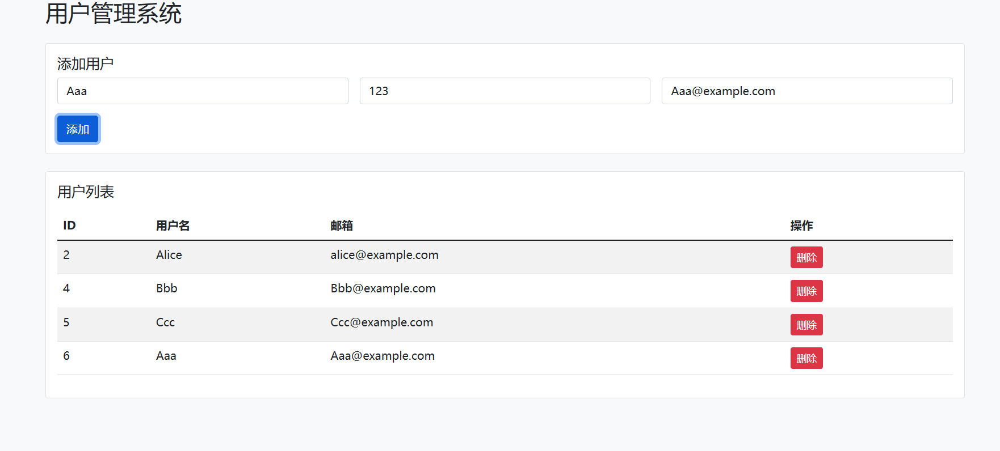
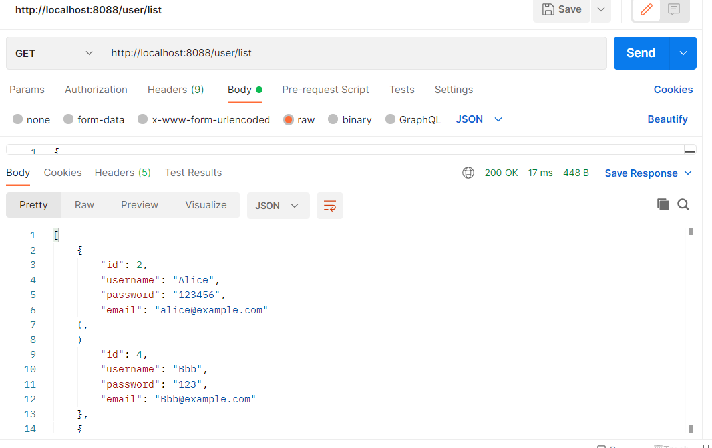

# User Management System

## 项目简介
一个简单的用户管理系统，使用 Spring Boot + MySQL + Axios + Bootstrap 实现增删改查功能，并提供前端可视化操作。

## 技术栈
- Java 17
- Spring Boot
- MySQL
- Axios
- Bootstrap 5

## 功能
- 添加用户
- 查看用户列表
- 编辑用户信息
- 删除用户

## 运行方式
1. 克隆仓库
```bash
git clone git@github.com:1240249956-debug/User-demo.git

## 项目截图

用户界面：


Postman 测试：

